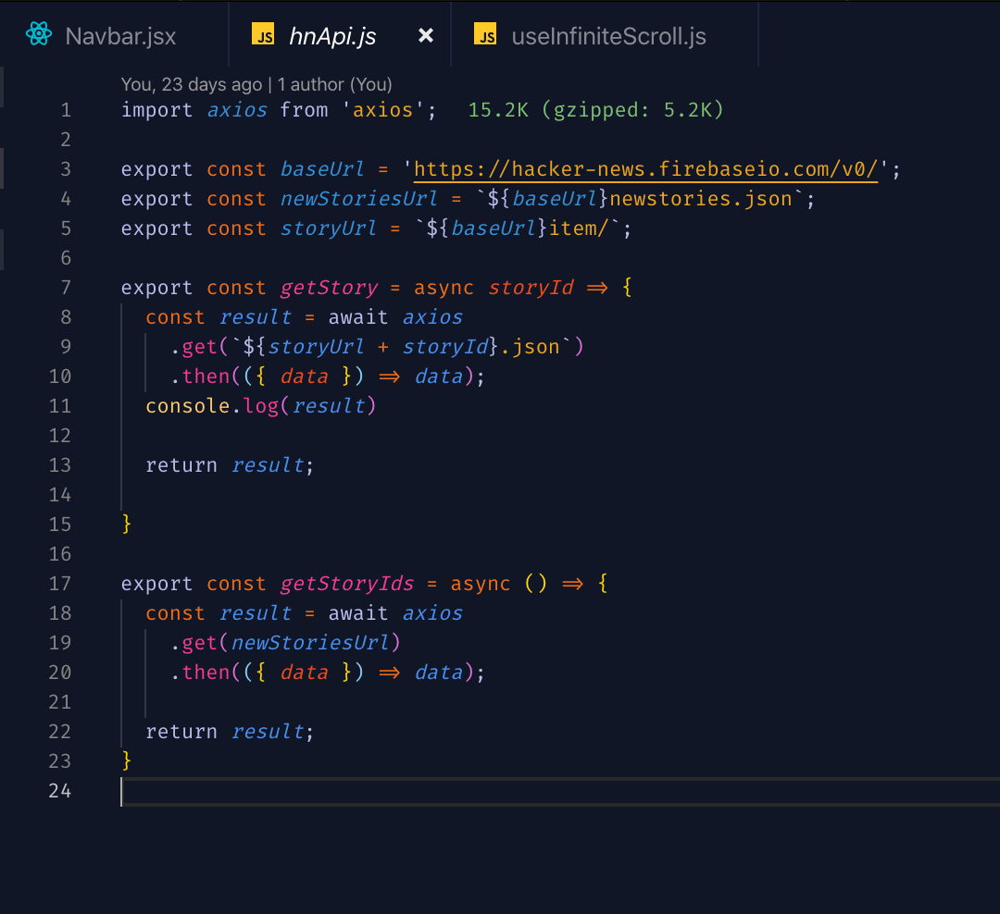
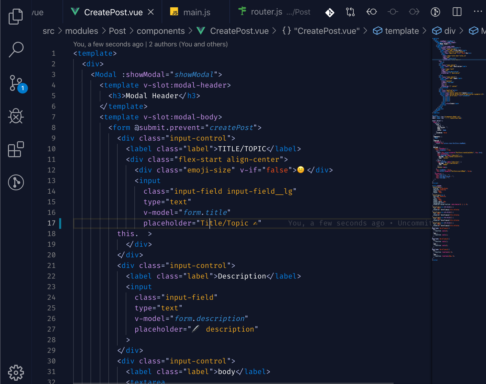

# Flames :fire:
Flames is a dark colored theme for 10x engineers. Associate Engineers, distinguished and extinguished engineers. :grin: :wink:

## Installation
To begin with, [install the base theme from the VS Marketplace](https://marketplace.visualstudio.com/items?itemName=wizsullivan.flames).

# Screenshots

## Feedback
This theme is gonna evolve, I will need feedback from potential users in order to make it better. :raised_hands:

## Author
Sullivan Wisdom

**Enjoy!**
